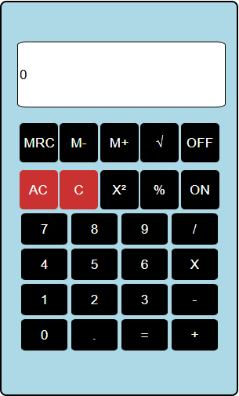

# ReactCalculator
This calculator performs operations.

Description: This calculator performs operations such as: multiplication, division, addition, substraction, M+, M+ and root square.

Technologies: HTML, CSS and React + Vite.

